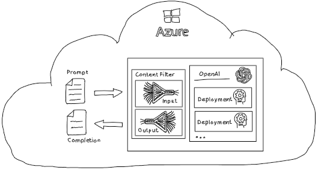
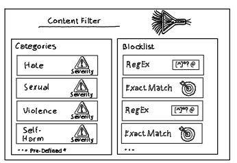

# AzureAI - Content Filter and Block Lists

## Overview

Azure OpenAI Content Filters are sophisticated tools designed to ensure the safe and appropriate use of LLMs.

Azure OpenAI Content Filter can inspect incoming requests or prompts to ensure they meet specific criteria before being processed by the language model. Additionally, it can review the model’s responses for compliance with custom requirements.

### Content Filter

Content Filter provide:

- fixed categories
- custom block lists (exact match or regular expression)

to annotate and/or block inappropriate content.

### Categories

Content filters classify incoming and outgoing data into risk categories based on the content’s nature and potential impact. These categories are:

- Hate
- Sexual
- Violence
- Self-Harm

Content will be analyzed and rated as **Low**, **Medium**, or **High** severity. Actions taken based on the severity rating of a category can be adjusted to suit specific requirements, such as whether content is blocked or annotated for low or for high severity ratings.

Microsoft provides optional categories:

***Input categories:***

- Prompt shields for jailbreak attacks
- Prompt shields for indirect attacks

***Output categories:***

- Protected material for text
- Protected material for code

### Block lists

Multiple block lists can be defined and can contain multiple block list items. Each block list item can be of type ***exact match*** or ***regular expression***. 

A single block list can be optionally added to a content filter to fine tune input and output checks.

### Documentation

Check the [documentation for details](https://learn.microsoft.com/en-us/azure/ai-services/openai/concepts/content-filter?tabs=warning%2Cuser-prompt%2Cpython-new)

## Repo Content

***Overview:***

|File | Description | Details |  
|------|-----|----|
|[./setup/setup.azcli](./setup/setup.azcli) | Azure CLI script to setup a demo Azure environment |  The script creates an Azure OpenAI instance and deploys an OpenAI gpt-35-turbo model. All necessary credentials and parameter needed to create a content filter and a block list using the Azure Management REST api are retrieved and [CreateContentFilter.http](./rest/CreateContentFilter.http) is updated|
| [./rest/CreateContentFilter.http](./rest/CreateContentFilter.http) | Script with Azure Management REST api calls | The script is using the [REST Client](https://marketplace.visualstudio.com/items?itemName=humao.rest-client) VS Code extension from Huachao Mao. |

***Details CreateContentFilter.http:***

The http REST calls to the Azure Management API performs the following tasks:

- Lists existing predefined rai policies
- Creates a custom rai policy
- Creates a custom block list
- Creates a block list item with exact match check. It checks for *CONTOSO FINANCIAL DATA*
- Creates a block list item with regular expression check. It check for valid e-mail addresses.
- Adds custom block list to custom policy
- Assigns policy to LLM deployment
- Performs llm deployment completion call with "*Contoso Financial Data*" in the prompt ***-> request will be blocked!***
- Performs llm deployment completion call with valid *e-mail address* in the prompt ***-> request will be blocked!***
- Performs  llm deployment completion call with valid prompt ***-> request will not be blocked!***

> **Attention:**
> The Azure Management API uses ***raiPolicies*** within the url path to retrieve and create custom ***content filter***
> 
> `GET https://management.azure.com/subscriptions/{{SUBSCRIPTIONID}}/resourceGroups/{{RESOURCEGROUP}}/providers/Microsoft.CognitiveServices/accounts/{{ACCOUNTNAME}}/raiPolicies?api-version=2024-10-01`